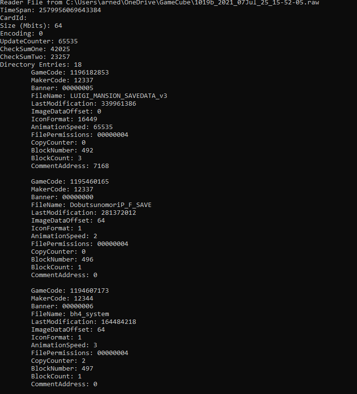

# GC MemoryCard Reader

This is a C#.NET tool for reading the binary dumps of Nintendo GameCube Memory Cards.
When you're using something like the Dolphin Emulator, or Homebrew that's able to create a complete, 1-to-1 binary copy of your memory card,
this tool will be able to read its contents.

# Under Development

To make it clear, this tool is still under development, and relies on paths and settings based upon my own system.
As development progresses, I will tweak the interface, code and usability so anyone can use this tool without problem.
The goal is to support Linux, macOS and Windows, using the .NET Core framework.

# Contributing

If you want to help out, by all means make pull requests, open issues and contribute.
I'd really appreciate for example more binary files to play with so I can ensure that the code supports all different systems out there.

# License
Pleasee see the [LICENSE.txt](LICENSE.txt)
